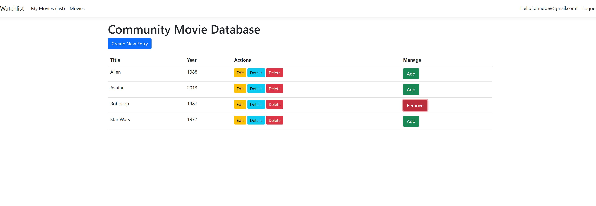

<h1 align="center">
  
</h1>

<h2 align="center">🎤 About Me - ⚠ Page Still Under Construction ⚠</h2>
<h3 align="center">👨‍💻 Web Developer | JavaScript Enthusiast | Versatile Coder 🚀 Always ready to adapt and deliver.</h3>

- 🔭 I’m currently working on a **Next.js** version of my [Portfolio](https://www.underconstructionpage.com/). 
- 🌱 I’m currently learning **.NET/C#**, **ASP.NET**, and **Kubernetes**. 
- 🎨 I work on frontend projects too, but I’ll be honest—**I’m not a designer**! Still, I always do my best to create clean user interfaces. 

 

  
  
  

<h2 align="center">💻 My Main Tech Stack 💻</h2>
 

  
  
  
  
  
  
  

  
  
  
  
  
  
  

<h2 align="center">🔧 Tools & Platforms 🔧</h2>
 

  
  
  
  
  
  

<h2 align="center">🎓 My Current Learning Focus 🎓</h2>

  
   
   

<h2 align="center">⚡ Stats ⚡</h2>
 

  <table>
    <tr>
      <td></td>
      <td></td>
    </tr>
  </table>

<h2 align="center">🌟 Showcase of my main projects and major exercices🌟</h2>

⚠️ Note: While most of these projects began as inspirations from my BeCode bootcamp or online YouTube videos (primarily from Dave Gray), I made it a priority to personalize each one and add extra features, ensuring my unique touch. Most of these projects are still in progress and will continue to evolve toward perfection. 🚧✨ 

| **Categories: Click the badges below to navigate to specific project sections.**                                                                                                                                                                                                                                   |
|-------------------------------------------------------------------------------------------------------------------------------------------------------------------------------------------------------------------------------------------|
|     |

<!-- 

  <a href="#full-projects" style="margin: 0 15px; font-size: 2rem; text-decoration: none; color: white; background-color: #007BFF; padding: 10px 20px; border-radius: 5px; transition: background-color 0.3s;">Full-Stack Projects</a>
  <a href="#frontend-ui" style="margin: 0 15px; font-size: 2rem; text-decoration: none; color: white; background-color: #28A745; padding: 10px 20px; border-radius: 5px; transition: background-color 0.3s;">Frontend UI</a>
  <a href="#backend-apis" style="margin: 0 15px; font-size: 2rem; text-decoration: none; color: white; background-color: #FFC107; padding: 10px 20px; border-radius: 5px; transition: background-color 0.3s;">Backend APIs</a>
  <a href="#utility-learning" style="margin: 0 15px; font-size: 2rem; text-decoration: none; color: white; background-color: #17A2B8; padding: 10px 20px; border-radius: 5px; transition: background-color 0.3s;">Utility & Learning Projects</a>

 -->

### <h3 id="full-projects"> 📚 Full-Stack Main Projects </h3> 

---

#### **JobTrackr**
A job tracking app built with HTML, SASS, and vanilla JavaScript to manage job applications. This project showcases my front-end skills, including the use of animations, modal management, and a card-based UI for a smooth user experience. The backend integrates with a REST API for data, using JWT for authentication and MongoDB for the database (hosted on the cloud).

[Live Preview on render](https://jobtrackr-6b0t.onrender.com) | [GitHub Backend Repository](https://github.com/Rashy-hub/JobTrackr) | [GitHub Frontend Repository](https://github.com/Rashy-hub/JobTrackr-Front)

---

#### **TaskTrackr**

A full-stack Todo List application built with Node.js, Express.js, and MongoDB, featuring user authentication with JWT, and complete CRUD operations for managing tasks. This project showcases secure user management, data persistence with MongoDB, and a clean, responsive frontend served from the backend. It highlights my ability to build robust backend services and integrate them with a dynamic frontend.

[Live Preview on render](https://todo-list-demo.onrender.com) | [GitHub FullStack Repository](https://github.com/Rashy-hub/todo-list-demo)

---

#### **Recipe Dream**

A recipe app a web application built with **React** that allows users to explore, create, and manage their favorite recipes. This app leverages the Appwrite backend (BAAS) for user authentication and data management, and integrates the Spoonacular Public API to fetch a wide variety of recipes and culinary information.

[Live Preview on render](https://recipe-react-app-va6l.onrender.com) | [GitHub Repository](https://github.com/Rashy-hub/Recipe-React-App)

---

#### **WatchList - ASP.NET Core MVC**

This is an **ASP.NET Core MVC** application, initially created using **Visual Studio 2022** with the default project template, including **ASP.NET Identity** for user authentication, **Bootstrap 5** for responsive design, and **Entity Framework Core** for database management.  
The project began by following the OpenClassrooms ASP.NET course, but I’ve expanded on it with additional features and extra content, such as a UML design.  
In summary, it’s a simple system for listing and rating movies you've seen or own. The application uses a **SQL Server** (localdb) to store the information you enter, including the rating (from 1 to 5 stars) you assign to each film. You can search, view, and sort your movie list using a variety of criteria.  
**Work is still in progress** 🚧

  
[No live Demo (WIP)](#) | [GitHub MVC Repository](https://github.com/Rashy-hub/WatchList)

---

#### **KriticArt-FullStack**

KriticArt is a MERN stack project focused on showcasing a powerful and scalable back-end API. This is the second version of the project, refactored into TypeScript to improve type safety and maintainability. The API is also documented with Swagger, enhancing usability for developers. KriticArt is a collaborative photo-sharing and review platform built using the MERN stack. Users can create accounts, upload photos from their devices or import them via third-party services. The platform allows users to comment on and rate photos, create personal galleries, and mark favorites. The homepage features a curated selection of random or thematic images, fetched from public APIs. The back-end, implemented in TypeScript, is designed for scalability and includes advanced functionalities like authentication, media uploads, and external API integrations.
**Work is still in progress** 🚧 

[No live Demo (WIP) ](#) | [GitHub  FullStack Repository](https://github.com/Rashy-hub/KriticArt-FullStack)

---

#### **TechNotes**

TechNotes is an API built with Express.js, enhanced based on a tutorial by Dave Gray to meet specific needs. This technical note management application features employee login, note assignment, ticket tracking, and user management with defined roles. The system allows employees to manage their assigned notes while providing managers and admins with broader access to edit and delete notes as needed.  
**Work is still in progress** 🚧

    

[GitHub Backend Repository](https://github.com/Rashy-hub/TechNotes) | [GitHub Front Repository](https://github.com/Rashy-hub/TechNotes-Client)

---

### <h3 id="frontend-ui">🎨 Frontend Projects</h3> 

---

#### **BeMovies**
A movie presentation application built with HTML/CSS and **Swiper.js**. This project showcases my front-end skills with a simple yet effective style and interactive carousels.

  
[Live Demo](https://bemovies.onrender.com) | [GitHub Repository](https://github.com/Rashy-hub/BeMovies)

---

#### **Portfolio - Original Design**
My first attempt to create an original portfolio using only HTML, CSS, and JavaScript. It features a typewriter effect, a timeline view, animated cards, and other sophisticated effects to showcase my design ideas.  

  
[GitHub Repository](https://github.com/Rashy-hub/portfolio-responsive-design)

---

### **Static Sites integration**

- [Ipsum News](https://github.com/Rashy-hub/Mini-Projects/tree/main/Frontend%20mini%20projects/HTML%26CSS%20projects/Ipsum%20News)
- [Pixel Perfect](https://github.com/Rashy-hub/Mini-Projects/tree/main/Frontend%20mini%20projects/HTML%26CSS%20projects/PixelPerfect)
- [Responsive Blog](https://github.com/Rashy-hub/Mini-Projects/tree/main/Frontend%20mini%20projects/HTML%26CSS%20projects/Responsive%20WebPage%20-%20Final)

Ces exercices d'intégration de designs Figma en pages statiques HTML/CSS démontrent mon souci du détail et ma capacité à traduire des maquettes de design en pages web fonctionnelles.  
  
  

---

### React Major Exercices

#### **Weather App**
Une application React qui consomme une API météo en utilisant Redux Toolkit. Démontre une gestion d'état efficace et une interface utilisateur réactive.  

  
[GitHub Repository](https://github.com/Rashy-hub/Weather-App)

---

#### **Emoji Search**
Une application React simple pour rechercher des emojis en utilisant des données JSON locales. Met l'accent sur une gestion d'état efficace et une interface utilisateur réactive.  

  
[Live Demo](https://emojisearch-db.onrender.com) | [GitHub Repository](https://github.com/Rashy-hub/emojiSearch-reactdemo)

---

#### **Multi-Step Form**
Un formulaire multi-étapes construit avec React, mettant en avant une interface utilisateur dynamique avec des transitions fluides et une gestion des données efficace. Intègre EmailJS pour les services d'email externes.  

  
[Live Demo](https://multistepform-ap6d.onrender.com) | [GitHub Repository](https://github.com/Rashy-hub/MultiStepForm)

---

#### **StopWatch**
Un chronomètre basé sur React avec une fonctionnalité de sauvegarde des tours. Ce projet démontre ma capacité à construire des applications basées sur le temps avec une gestion d'état complexe.  

  
[Live Demo](https://stopwatch-bd8y.onrender.com) | [GitHub Repository](https://github.com/Rashy-hub/StopWatch)

---

#### **Markdown Reader**
Une application React qui rend le contenu Markdown, démontrant ma capacité à travailler avec des fichiers Markdown dans un environnement React.  

  
[Live Demo](https://markdown-reader.onrender.com) | [GitHub Repository](https://github.com/Rashy-hub/MarkDown-Reader)

### 🧩 Utility & Learning Projects

---

---
<h2 align="center">🚀 Featured Repositories 🚀</h2>
 

  
  
  

<h2 align="center">📫 Get in Touch 📫</h2>
 

  
  
  

