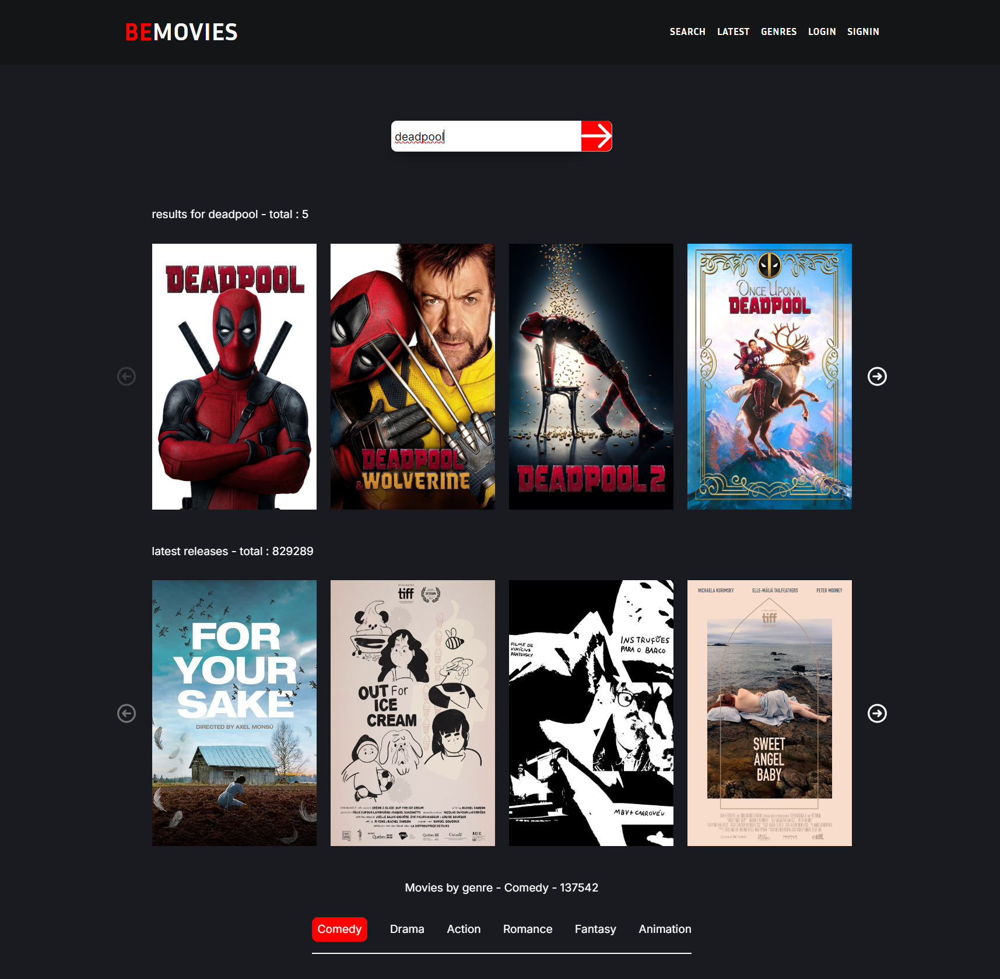

<h1 align="center">
  
</h1>

<h2 align="center">🎤 About Me - ⚠ Page Still Under Construction ⚠ </h2>
<h3 align="center">👨‍💻 Web Developer | JavaScript Enthusiast | Versatile Coder 🚀Always ready to adapt and deliver.</h3>

  - 🔭 I’m currently working on a **Next.js** version of my [Portfolio](https://www.underconstructionpage.com/). 
  - 🌱 I’m currently learning **.NET/C#**, **ASP.NET**, and **Kubernetes**. 
  - 🨠I work on frontend projects too, but I’ll be honest—**I’m not a designer**! Still, I always do my best to create clean user interfaces. 

 

<h2 align="center">💻 My main tech stack 💻</h2>
 

  
  
  
  
  
  
  
     
 

 

  
  
  
  
  
  
  
  

<h2 align="center">🎓 My current learning focus 🎓</h2>

 
  
  

<h2 align="center">⚡ Stats ⚡</h2>
 

  <table>
    <tr>
      <td></td>
      <td></td>
    </tr>
  </table>

### Showcase of Projects Completed During My BeCode Bootcamp

⚠️ **Note**: *While these projects started with the same guidelines for everyone, I made it a priority to personalize and add extra features to each one, ensuring my unique touch. Most of these projects are still in progress and will continue to evolve toward perfection.* 🚧✨ 

- [**BeMovies**](https://bemovies.onrender.com)  
  *A movie showcase app built with HTML/CSS and Swiper.js.*  
  This project highlights my front-end skills, using simple but effective styling with Swiper.js for carousels. 
  [Check the repo here ](https://github.com/Rashy-hub/BeMovies)
  
  

- [**JobTrackr**](https://jobtrackr-6b0t.onrender.com)  
  *A job tracking app built with React to manage job applications, consuming a REST API for data.* 
  This project highlights my front-end expertise, including the use of animations and card-based UI for a smooth user experience.  
  [Check the repo here ](https://github.com/Rashy-hub/JobTrackr)

  

- [**Recipe App**](https://recipe-react-app-va6l.onrender.com)  
  *A recipe app that uses Appwrite BaaS as a backend.*  
  This project shows my full-stack skills, integrating React with Appwrite for backend functionalities like data storage and authentication.  
  [Check the repo here ](https://github.com/Rashy-hub/Recipe-React-App)

  

- [**Todo List Demo**](https://todo-list-demo.onrender.com)  
  *A full-stack todo app with Express.js handling authentication, REST API CRUD operations, and serving static files.*  
  This project demonstrates my back-end expertise with Node.js and Express, covering key functionalities like user authentication and data management.  
 
  [Check the repo here](https://github.com/Rashy-hub/todo-list-demo)

  

- [**Emoji Search**](https://emojisearch-db.onrender.com)  
  *A simple React app for searching emojis.*  
  This showcases my React skills with a focus on efficient state management and a responsive UI.  

  [Check the repo here](https://github.com/Rashy-hub/emojiSearch-reactdemo)

  

- [**Markdown Reader**](https://markdown-reader.onrender.com)  
  *A React app that renders markdown content.*  
  A simple but functional tool demonstrating my ability to work with markdown files in a React environment.  

  [Check the repo here](https://github.com/Rashy-hub/MarkDown-Reader)

  

- [**Multi-step Form**](https://multistepform-ap6d.onrender.com)  
  *A multi-step form built with React.*  
  This app showcases my skills in building dynamic, form-based UIs using React for smooth transitions and data handling.  

  [Check the repo here](https://github.com/Rashy-hub/MultiStepForm)

  

- [**Stopwatch**](https://stopwatch-bd8y.onrender.com)  
  *A React-based stopwatch with lap-saving functionality.*  
  This project demonstrates my ability to build time-based applications with complex state management.  

  [Check the repo here](https://github.com/Rashy-hub/StopWatch)

  

<h2 align="center">🚀 Featured Repositories 🚀</h2>
 

  
  
   
 

<!--

**Rashy-hub/Rashy-Hub** is a ✨ _special_ ✨ repository because its `README.md` (this file) appears on your GitHub profile.
 
Here are some ideas to get you started:

- 🌱 I’m currently learning ...
- 👯 I’m looking to collaborate on ...
- 🤔 I’m looking for help with ...
- 💬 Ask me about ...
- 📫 How to reach me: ...
- 😄 Pronouns: ...
- ⚡ Fun fact: ...
-->
